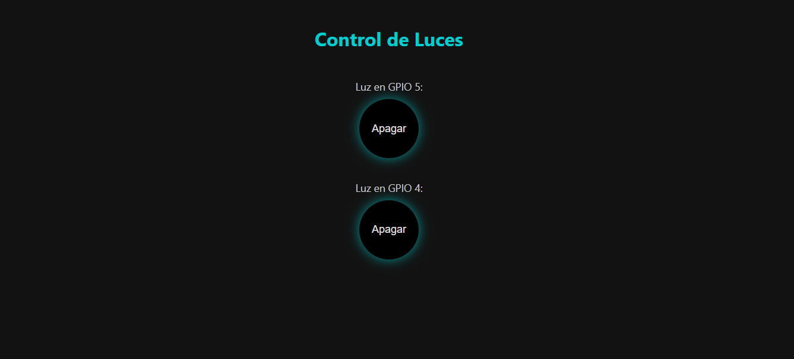
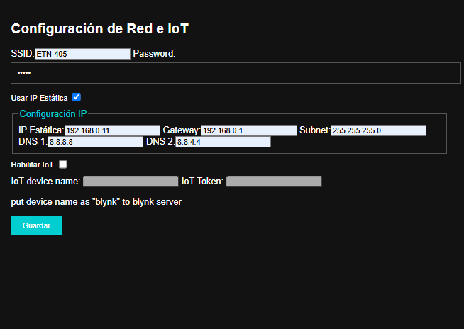

# nodemcu-relay-iot-module
friendly usage and config nodemcu to conect lights offine (local ip) and online ( arduino cluoud / Blynk IoT)

- upload code via arduinoide
- conect wifi to ESP8266config
- navgegate to ip (tipical 192.168.4.1 )
- configuration page ip/config http://192.168.4.1/config
- help http://192.168.4.1/help

if use arduino cloud (not recomended ) flash iot_luces_v4.ino 
-
if use Blynk IoT (very recomened) flash iot_luces_v6.ino or later 
-
